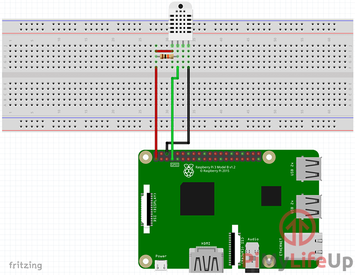

# Room Temps

(only tests on NodeJS v21.6.2)<br>
NodeJS ES6 webserver with **DHT22** sensor and database.

## Sensor connection

Used **GPIO 4** & 10kOhm resistance.
The sensor data is saved in the database every 20 minutes.

(change the PIN in ./app/sensor.mjs if its necessary)

Lib: [node-dht-sensor](https://www.npmjs.com/package/node-dht-sensor)

## Database

It used [level](https://www.npmjs.com/package/level) as file only database and stores data in `./db`

## Webserver:

access: \<IP>:3000/\*

/get-today:<br>
array of all data from today

/get-active-month:<br>
array of all data from month

## Usage:

install and start up via [pm2](https://pm2.keymetrics.io/):

```bash
$ git clone https://github.com/samy-blake/room-temps
$ cd room-temps
$ npm install
$ pm2 start app.mjs --name=room-temps
```
